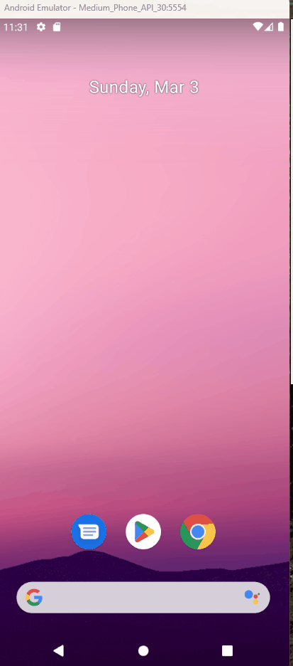

Minimal authentication and token acquisition sample for Microsoft.Identity.Client (MSAL) in a .NET MAUI app. This sample demonstrates how to use MSAL to sign in users and acquire tokens to call an API protected by Entra/Azure AD.

When updating ClientId in appsettings.json you will also manually have to update the DataScheme in `Platforms\Android\MsalActivity.cs`.

